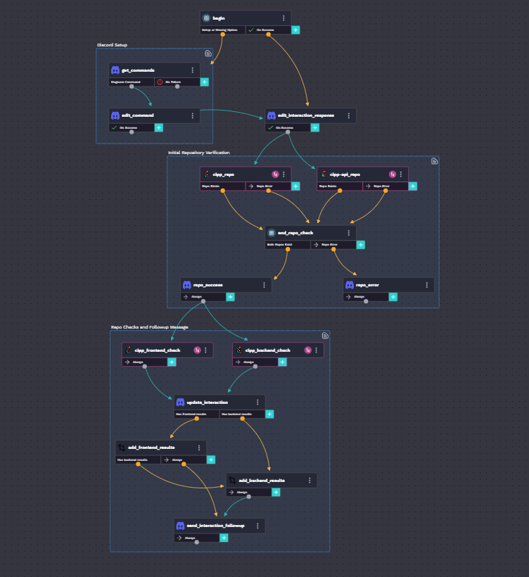
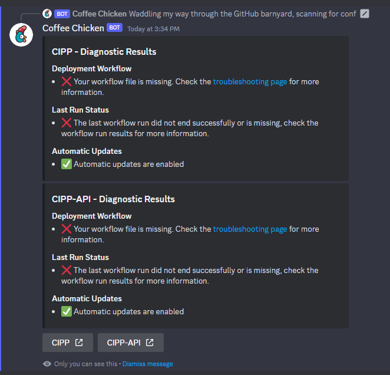

# CIPP Repository Diagnostic

## Description

This is a workflow that diagnoses CIPP GitHub Repositories and posts the results to Discord. See it in action by typing `/diagnose` on [CyberDrain](https://discord.gg/cyberdrain).

## Components

### Integrations

- Custom API Integration (GitHub)
- Discord

### Workflows

- [CIPP] Repository Diagnostic
  - Main workflow called from Discord slash commands.
- [CIPP] Sub-Workflow - Perform Repository Checks
  - This sub-workflow is called for each user repository under a GitHub user or organization. It verifies that the deployment workflows for Azure are working as intended.
- GitHub HTTP Request
  - Sub-workflow that calls GitHub APIs.

### Org Variables

- **discord_guild_id** - Required
  - Identifier for Discord guild to install the slash command.
