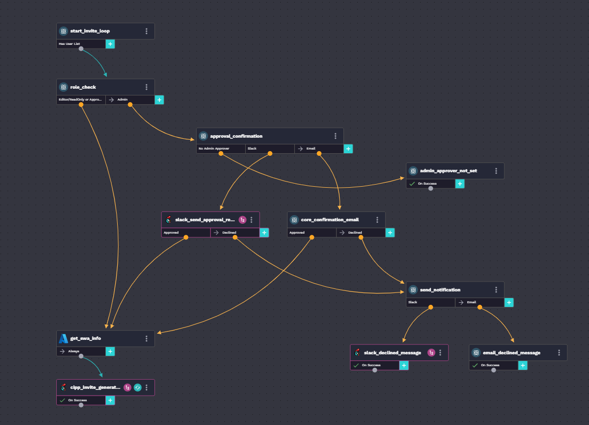

# CIPP User Invite

## Description

This is a workflow that takes Microsoft CSP users and invites them to [CIPP](https://cipp.app).

## Components

### Integrations

- Microsoft CSP
- Microsoft Azure
  - Rewst Application must have permission to invite users to SWA
- Slack (optional)

### Form

- CIPP User Invite

### Workflows

- CIPP Invite Generator
  - Main workflow called from the form. If the admin role is selected, approval will be requested.
- CIPP Invite Generator - Per User
  - This sub-workflow is called for each user selected on the form. It will create an invite link for SWA with the selected role and send a welcome message to the user.
- Option Generator - Uninvited CIPP Users
  - This workflow gets a list of all users in Microsoft CSP that are not currently in CIPP.
- Slack - Send Approval Request to User
  - This sub-workflow opens up a conversation with a Slack user by email address and sends a confirmation message
- Slack - Send Message to User
  - This sub-workflow sends a message to a slack user by email address

### Org Variables

- **cipp_swa_name** - Required
  - Name of CIPP SWA resource (e.g. cipp-swa-blah)
- **cipp_resource_group** - Required
  - Name of CIPP Resource Group (e.g. CIPP)
- **cipp_notification_type** - Optional
  - Choices - email,slack (Default: email)
- **cipp_approver_email** - Required for admin role invites
  - Set approver email address
